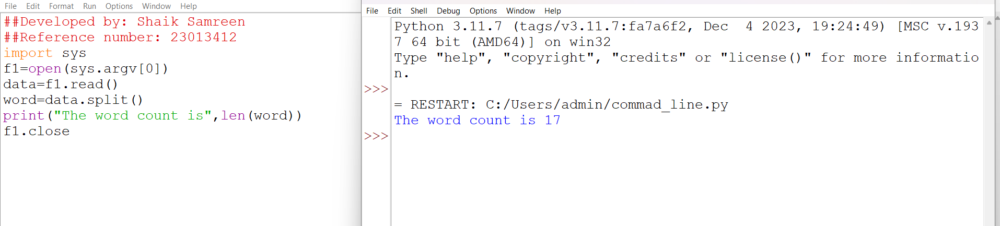

# command-line-arguments-to-count-word
## AIM:
To write a python program for getting the word count from the contents of a file using command line arguments.
## EQUIPEMENT'S REQUIRED: 
PC
Anaconda - Python 3.7
## ALGORITHM: 
### Step 1:
Start the program.
### Step 2: 
Import the file. 
### Step 3: 
Open the file.
### Step 4:  
Write th function to count the words.
### Step 5: 
Print the result.
### Step 6: 
Execute the program.
## PROGRAM:
```
##Developed by: Shaik Samreen
##Reference number: 23013412
import sys
f1=open(sys.argv[0])
data=f1.read()
word=data.split()
print("The word count is",len(word))
f1.close

```
### OUTPUT:



## RESULT:
Thus the program is written to find the word count from the contents of a file using command line arguments.
